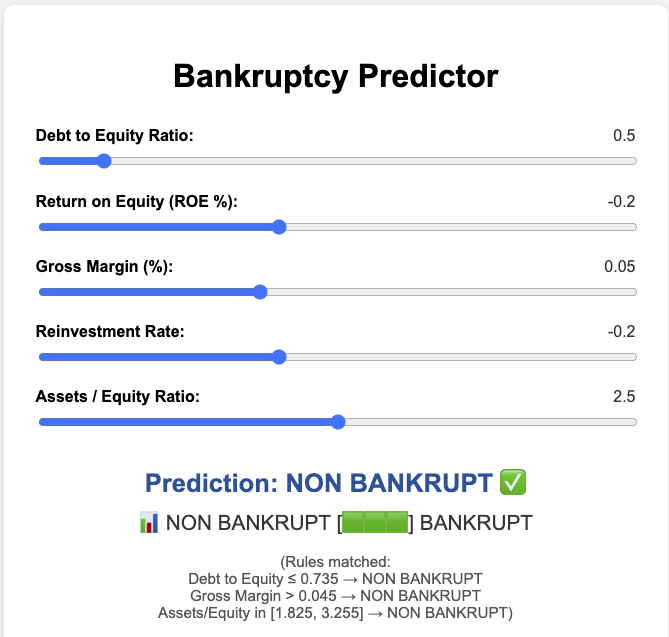

# Bankruptcy Predictor

**Bankruptcy Predictor** is a simple, interactive web app based on key financial ratios for predicting company bankruptcy. Built entirely with HTML, CSS, and vanilla JavaScript, it uses a rule-based classifier with a visual voting system to help users understand how financial features influence the outcome.

 <!-- Optional: replace with your actual screenshot filename -->

---

## 🔍 Features

- Real-time input sliders for five financial indicators:
  - Debt to Equity Ratio
  - Return on Equity (ROE)
  - Gross Margin
  - Reinvestment Rate
  - Assets / Equity Ratio
- 📊 Emoji-based voting bar (🟩 = NON BANKRUPT, ⬜ = BANKRUPT)
- ✅ Live prediction is displayed instantly without clicking any button
- 🧠 Rule-based decision engine with visible rule matching
- 📝 Tooltip explanation on voting bar
- 📥 Download full result as a styled PDF
- 💡 Ideal for education, demonstration, or quick risk screening

---

## ⚙️ How It Works

The app uses 5 pre-defined rules derived from financial ratios. Each rule votes either `BANKRUPT` or `NON BANKRUPT`. The final prediction is made based on **majority voting**.

| Rule | Logic | Prediction |
|------|-------|------------|
| 1 | Debt/Equity ≤ 0.735 | NON BANKRUPT |
| 2 | ROE ≤ -0.245 | BANKRUPT |
| 3 | Gross Margin > 0.045 | NON BANKRUPT |
| 4 | Reinvestment Rate ≤ -0.425 | BANKRUPT |
| 5 | Assets/Equity in [1.825, 3.255] | NON BANKRUPT |

---

## 🚀 Getting Started

### 🔧 Run Locally

1. Clone the repository:
   ```bash
   git clone https://github.com/yourusername/bankruptcy-predictor.git
   cd bankruptcy-predictor
